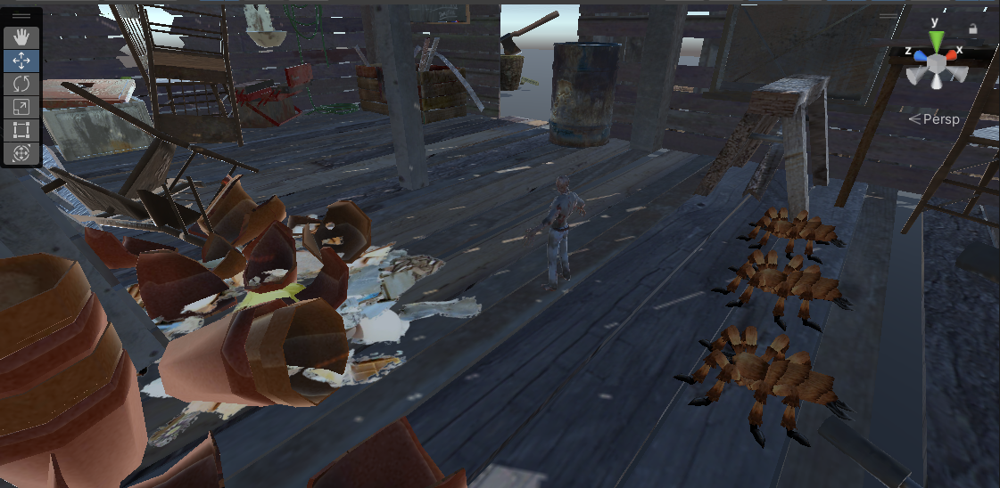

# pruebaVR

### Ejercicio 1, crear la escena

### Ejercicio 2 y 3, movimiento del zombie y teletransportación

### Ejercicio 4 teletransportar macetas y mover sillas cuando el zombie se acerca a la pizarra

### Ejercicio 5 Arañas se avalanzan sobre el zombie al tocar la silla

### Ejercicio 6 configuración para cardboard

